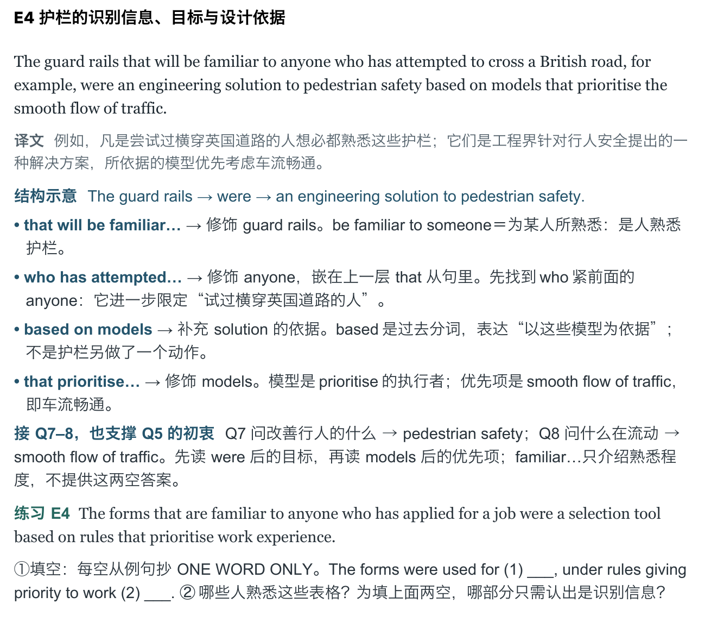

<p align="center">
  
</p>

把阅读原文、题目和作答交给 Codex，得到一份**适合自己水平、可以反复练习的精读 Word**。从全文选择值得学的句子，讲清修饰、并列、指代和否定；再对照真实题干积累考点表达，明确读到哪层证据就能作答，减少重复寻找和无依据的犹豫。



[下载 Word 示例](examples/demo-reader.docx) · [查看原创短文与题目](examples/demo-source.md) · [查看构建数据](examples/demo-reader.json)

示例短文、题目和练习均为原创，答题记录为虚构。现有示例 Word 和预览含旧版复盘内容，主要供查看排版，不代表新的默认章节；使用时从你自己的阅读材料生成精简文稿。

## 装进 Codex

下载本仓库，将整个文件夹放到：

```text
~/.codex/skills/ielts-close-reading/
```

`SKILL.md` 应直接位于该目录下。如果设置了 `CODEX_HOME`，则放到其 `skills` 子目录。重新打开会话后，用 `$ielts-close-reading` 调用。

也可以把仓库链接或本地文件夹交给 Codex，说：

> 请把这个项目作为 `ielts-close-reading` Skill 安装到我的 Codex 技能目录。

## 给它什么

提供文章即可开始；有完整题目、自己的答案和批改结果，选句、句内考点联系与表达积累会更有针对性。也可以附上自己整理的做题方法文档，把适用方法落实到本篇题干和证据。支持直接贴文本，或让 Codex 读取 PDF、图片和 Word。扫描件与答案颜色需要实际看页面核对。

把材料附上后，直接说：

> 使用 `$ielts-close-reading`，把这篇文章做成精读 Word。我参加机考，词汇量大约 6000，修饰部分经常接不上。请保留全文经典难句，结合全部原题和我的作答校准选句，在句内讲清相关答案条件和省时动作，积累真实改写；每句后配新例句，练习答案放最后。

上面的水平描述只是用法示例，换成自己的情况即可。答案文件使用什么颜色、哪一份记录了你的真实作答，也一起说明；不清楚的地方会保留为待核实。

## 文稿里有什么

| 部分 | 你会看到 |
| --- | --- |
| **全文典型句精读** | 完整原句、整句译文、按难点展开的连接解析、句内考点联系、必要的上下文说明和句后练习 |
| **考点表达与同义改写** | 真实原题改写与原创迁移分开，保留原文位置、适用条件和推断方向 |
| **阅读词汇** | 本篇义项、熟词生义与必要搭配，放回原文理解 |
| **常用表达** | 英文词组与中文释义并排，下面配自然例句和译文 |
| **练习参考答案** | 所有句后练习的具体关系判断与完整译文，统一放在文末 |

为控制篇幅，默认不输出“原题考点与快速核对”“错题复盘”“换材料再判断”三个独立章节及换材料题的答案；只有你明确要求恢复这些独立章节时才加入。句内考点联系、句后练习及其答案都会保留。

**选句数量跟着文章和你的理解走。** 错题相关的句子要讲，全文中值得训练的典型句也会保留；做对一道题不意味着删去相关经典句。仍会核对正确题和错题，用题目证据校准选句；短证据句可保留在内部对应记录，无须都扩成长难句。没有提供的题型不会被编造成原题。

解析直接说明连接关系。例如：

> **from which → 接回 the rear corner。** 可还原为 *from the rear corner*，说明读者从哪个位置看见入口。

有对应题目时，继续说明这处关系如何限制答案。例如题目问“建议被拒绝的原因”，读到拒绝事件先定位，再读清原因才选段；记录原题中的实际表达，而非只写“注意逻辑”或背一串万能同义词。

英文原句保留一个连续段落，解析放在下面。中文采用清晰的黑体，英文原句采用 Georgia；深蓝帮助定位关系，青绿区分练习。Word 保持可编辑，字体可按本机环境替换。

## 越练越贴近你的卡点

做完新例句后，把自己的分析发回来：

> A2 的 from which 我懂了，但 without being seen 还是接反了。请帮我检查回答，调整这部分解析，再给一道同结构练习。

Skill 会根据回答，区分**独立读对、提示后理解、仍有误读**，再调整讲解深度。紧跟解析答对一道同结构题，先作为这次练习的结果；需要时再用无提示的新材料复核。你可以用自己的话解释，不必背语法术语或照抄译文。

它把能核实的作答与需要验证的错因分开：一次选错不足以断言你不会某种语法。每道练习也会核对是否真正测到原句难点，避免题目给出过多提示，或用更简单的指代绕过原来的困难。

只想改外观，也可以直接说：

> 内容已经可以了，只调整字体、颜色和分页，保留所有文字与完整原句。

## 想复用排版脚本

平时直接让 Codex 处理即可。脚本负责校验和排版，选句、翻译、题目证据与改写判断由 Codex 根据材料完成。原题对应、作答与额外检查题可以保留为内部数据，支持选句校准和改写来源核验；有内容的 `paraphrases` 仍生成改写表。模型默认将 `meta.include_review_sections` 设为 `false`（省略时同样为 `false`），仅在你明确要求恢复上述独立章节时设为 `true`；平时无需手工填写这些字段。已有 JSON 无须迁移，重新构建时采用新的默认章节。

若想在本地复现示例，在仓库根目录运行：

```bash
python -m pip install -r requirements.txt
python scripts/build_reader.py examples/demo-reader.json --check-only
python scripts/build_reader.py examples/demo-reader.json --output output/demo.docx
```

默认字体对应 macOS 示例。其他系统请指定已安装的字体，例如通过 `--cjk-font` 替换中文字体；渲染后检查字形和分页。生成 Word 依赖 Python 与 `python-docx`，视觉核验另需可用的 Word、LibreOffice 或 Codex 文档渲染工具。

<details>
<summary>内容标准、数据格式与样式参数</summary>

- [Skill 入口](SKILL.md)：任务范围、工作流与交付要求。
- [阅读解析标准](references/reading-method.md)：怎么选句、讲连接和设计练习。
- [题目核对方法](references/question-focus.md)：把填空、段落信息匹配和判断题接到真实证据与省时动作。
- [答案核对标准](references/answer-audit.md)：怎么读取作答、定位证据与描述不确定错因。
- [Word 排版标准](references/word-layout.md)：字体、配色、间距与分页。
- [数据格式](references/data-format.md)：构建脚本需要的 JSON。
- [样式参数](assets/word-style.json)：可复用的字体与颜色设置。

</details>

这是一套精读制作流程，不是官方题库或自动评分系统。原文、答案与解析需要相互核对，示例不代表学习效果或分数承诺。
